# 🏫 **EazyCampusERP**


**EazyCampusERP** is a **college management web application (mini ERP)** built with **Spring Boot** and **Thymeleaf**.  
It allows students to manage their profiles and courses, while admins can manage classes, courses, and inquiries through a secure dashboard.  
The project demonstrates a **full-stack approach to building an ERP-style system** for educational institutions.

---

## 🌟 **Features**
✔ **Student Registration & Profile Management**  
✔ **View Enrolled Courses, Classes, and Subjects**  
✔ **Admin Dashboard for College Management**  
✔ **Manage Classes & Courses** (Add, Edit, Remove)  
✔ **Assign Students to Classes and Courses**  
✔ **Handle Inquiries from Contact Forms**  
✔ **Secure Authentication using Spring Security**  
✔ **Responsive & Clean UI with Thymeleaf**  

---

## 🛠 **Tech Stack**

### **Backend (Java + Spring Boot)**
- ☑ **Spring Boot**  
- ☑ **Spring Data JPA**  
- ☑ **Spring Security**  
- ☑ **MySQL Database**  
- ☑ **Lombok**  
- ☑ **Validation & Form Handling**  

### **Frontend**
- ✅ **Thymeleaf Templates**  
- ✅ **W3Layouts**  
- ✅ **Responsive UI Components**  

---

## ⚡ **Core Functionalities**

### **Student Portal**
- ✅ Register, Login & Update Profile  
- ✅ View Enrolled Courses & Classes  
- ✅ Access Subject Information  

### **Admin Portal**
- ✅ Admin Login & Profile Management  
- ✅ Manage Classes, Courses, and Student Assignments  
- ✅ View & Respond to Inquiries  
- ✅ Dashboard with Overview of College Activities  

---

## 📊 **Dashboard Features**
- **Total Students & Courses Overview**  
- **List of Classes & Subjects**  
- **Inquiry Messages Summary**  
- **Student Assignment Management**  

---

## 🔒 **Security**
- **Authentication & Authorization using Spring Security**  
- **Role-based Access** (Admin vs Student)  

---

## 📂 **Project Structure**
```
EazyCampusERP Portal
│
├─ src/main/java/com/eazybytes/eazyschool
│   ├─ annotation
│   ├─ aspect
│   ├─ audit
│   ├─ config
│   ├─ constant
│   ├─ controller
│   ├─ model
│   ├─ repository
│   ├─ rest
│   ├─ service
│   ├─ security
│   └─ validation
│
├─ src/main/resources
│   ├─ templates
│   └─ static
│
└─ pom.xml
```

---

## 📸 Screenshots – EazyCampusERP Portal

### 🏠 Homepage – Hero Section
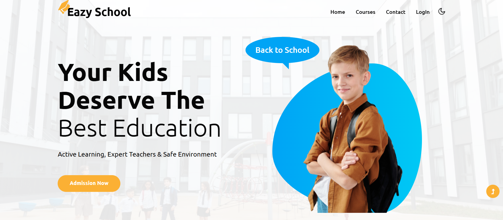
Landing page hero section introducing the EazyCampusERP Portal with navigation and call-to-action.

---

### ⭐ Homepage – Best Features
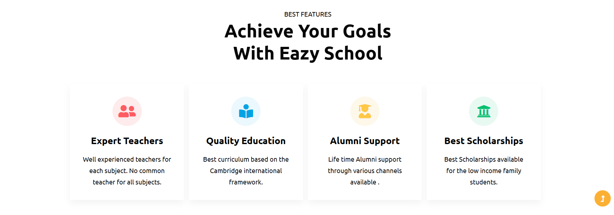
Highlights the key features and benefits offered by the ERP portal.

---

### 🎯 Homepage – Why Choose Us
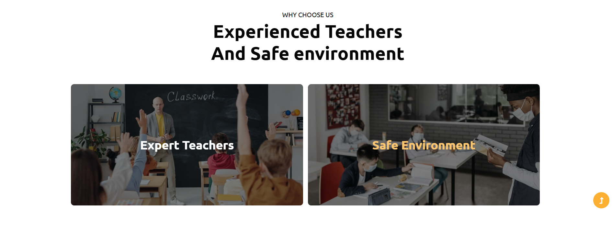
Explains why institutions should choose EazyCampusERP for college management.

---

### 📊 Homepage – Our Statistics
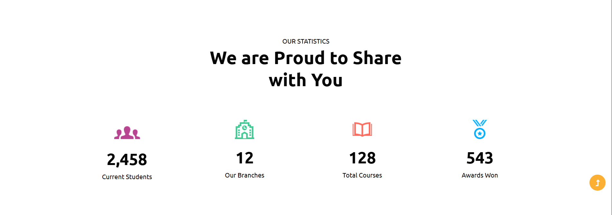
Displays important statistics such as students, courses, and classes.

---

### 🔻 Homepage – Footer
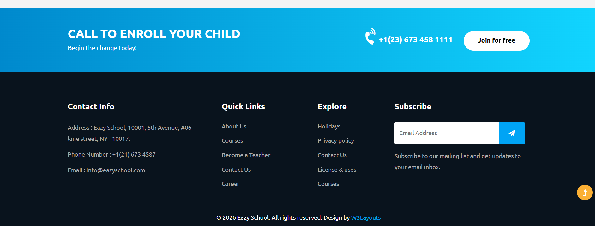
Footer section containing contact details, quick links, and social media references.

---

### 📚 Courses Page
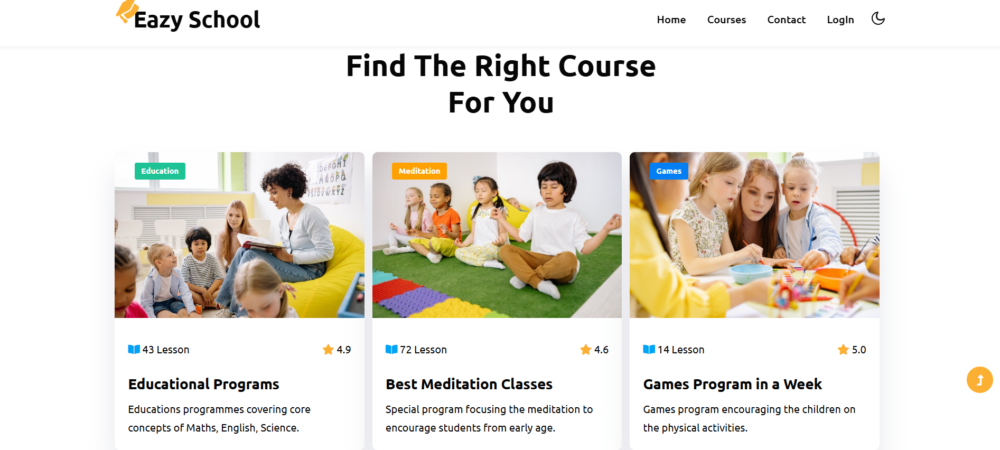
Shows all available courses offered by the college with complete course details.

---

### 📩 Contact Us Page
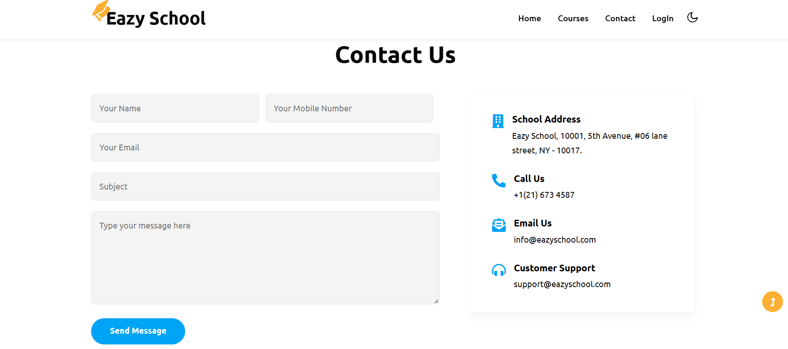
Allows users to submit inquiries and messages directly to the admin.

---

### 🔐 Login Page
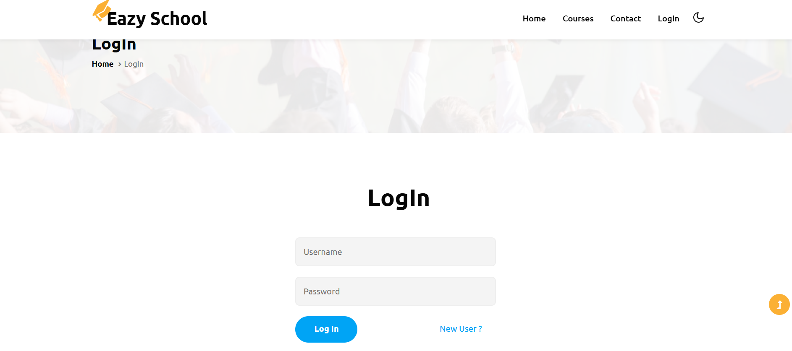
Secure authentication page for students and administrators.

---

### 📝 Registration Page
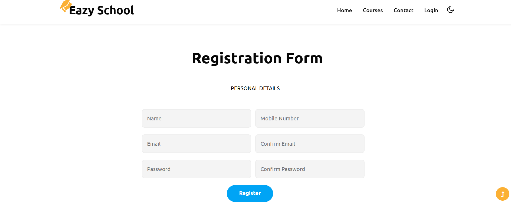
Student registration page for new users to create an account.

---

### 🎓 Student Dashboard
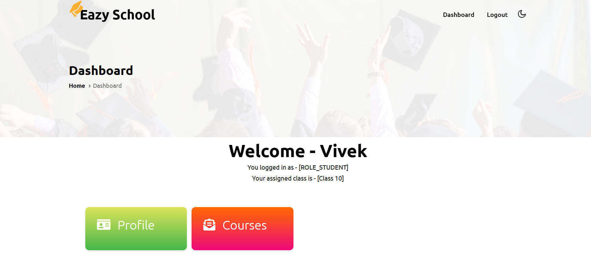
Student dashboard showing an overview of enrolled classes and courses.

---

### ✏️ Student Profile Edit
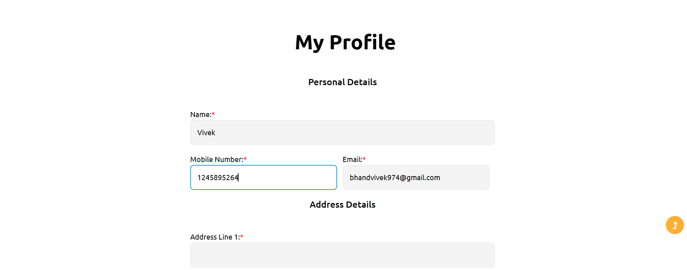
Students can edit and update their personal and academic profile details.

---

### 📖 Student Enrolled Courses
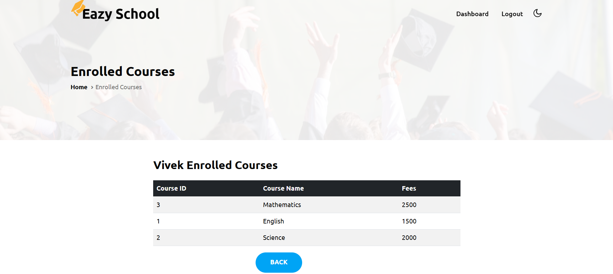
Displays the list of courses in which the student is currently enrolled.

---

### 🧑‍💼 Admin Dashboard
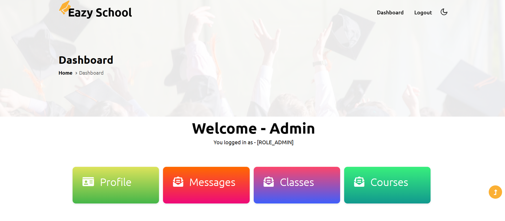
Admin dashboard providing full control over classes, courses, and students.

---

### 💬 Contact Messages (Admin)
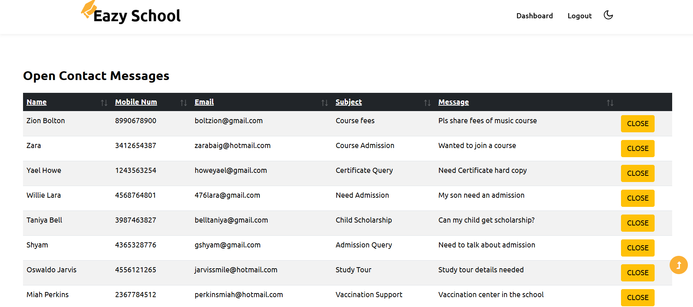
Admin can view and manage messages received from the contact page.

---

### 🏫 Class Management
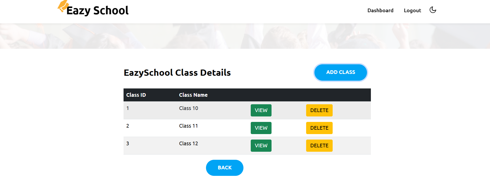
Admin can add, update, and manage class-related information.

---

### 👥 Class-wise Student Management
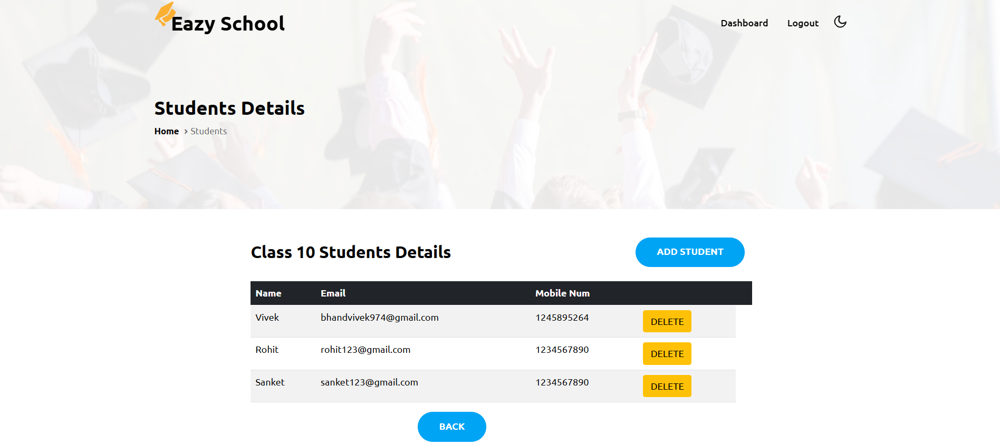
Admin can view and manage students enrolled in a specific class.

---

### 📘 Course Management

Admin can add, update, and manage course details efficiently.

---

### 🎯 Class-wise Course Assignment
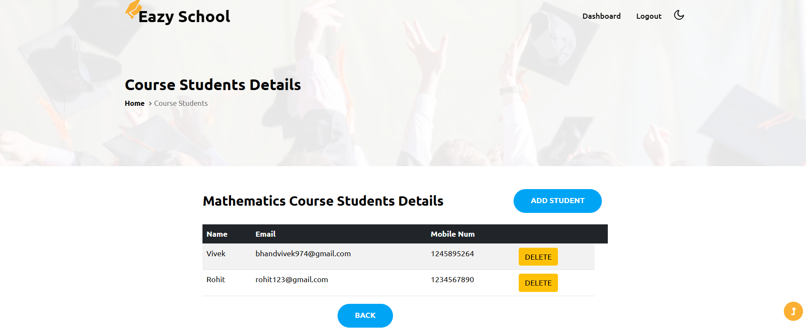
Admin can manage and assign courses to students within a particular class.

---

### 🎯 Class-wise Course Assignment
Admin can manage courses assigned to students within a particular class.


